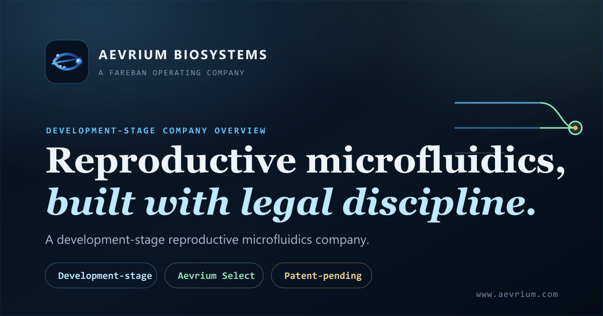

<div align="center">



# Aevrium Biosystems

### *Aevrium Select — reproductive microfluidics for IVF labs*

The public website for **Aevrium Biosystems**, a development-stage
reproductive-microfluidics company and a [Fareban Holdings](https://www.farebanholdings.com/)
operating company.


</div>

---

## Overview

[`aevrium.com`](https://aevrium.com) is a single, fully **self-contained** static
page — all CSS, JavaScript, and images are inlined into one `index.html`. No
framework, no build step, and no server-side code: contact CTAs are `mailto:`
links. It auto-deploys to **Namecheap cPanel over FTPS** on every push to `main`.

> [!IMPORTANT]
> **Disclosure posture.** All public content is **non-enabling and patent-safe** —
> no device geometry, dimensions, drawings, or operating recipes. Figures are
> management assumptions for discussion only and are not guarantees, clinical
> claims, regulatory clearance, or investment advice.

---

## Design system — *Clinical Precision*

A deep-ink, premium, scientific-credibility aesthetic.

| Layer          | Choice                          | Why                                              |
| -------------- | ------------------------------- | ------------------------------------------------ |
| **Display**    | High-contrast serif             | Editorial, peer-reviewed gravitas                |
| **Body**       | Inter                           | Fast, neutral, highly legible                    |
| **Data**       | Mono · tabular figures          | Numbers read like an instrument                  |
| **Signal**     | Cyan `#66c8ff`                  | CTAs, links, data highlights                     |
| **Viability**  | Mint `#94e2b2`                  | Biology / positive signals                       |
| **Provenance** | Gold `#d8b36a`                  | **Fareban links only** — kept scarce             |
| **Surface**    | Ink `#07111f`                   | Calm, controlled, expensive                      |

---

## Structure

```
apex/
  index.html                 # the entire self-contained site
  assets/                    # favicon set + OG share image (aevrium-og.png + .svg source)
.github/workflows/deploy-cpanel.yml   # FTPS deploy on push to main
docs/DEPLOY-CPANEL.md
```

## Deploy & preview

- **Deploy:** auto-publishes `/apex` → cPanel `public_html` over FTPS on every
  push to `main`. See [`docs/DEPLOY-CPANEL.md`](docs/DEPLOY-CPANEL.md).
- **Preview:** open `apex/index.html` directly in a browser — there is no build step.

---

## Part of the Fareban Holdings family

| Company | Site |
| --- | --- |
| Fareban Holdings *(parent)* | https://farebanholdings.com |
| **Aevrium Biosystems** | https://aevrium.com |
| Nevulium Biosystems | https://nevulium.com |
| Kura Biopreservation | https://kurastasis.com |

---

<div align="center">

**© Aevrium Biosystems — proprietary. All rights reserved.**

A Fareban Holdings operating company.

</div>
